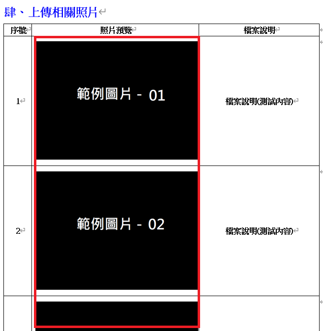
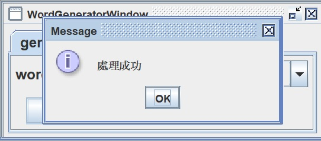

# 動態模版Word文件生成系統


## 公共程式描述

使用 [Poi-tl](https://deepoove.com/poi-tl/) 模板引擎作為核心技術，透過 Word 模板實現動態文檔生成。可適用於批量處理與高併發應用，如報告生成、合同製作和邀請函定制等。

使用者只需在 Word 編輯器中設計模板，利用簡單的標記語法（如 {{name}}、{{table}} 等）定義占位符，便可設定所需的樣式與結構。程式端負責處理資料準備與格式轉換，包括資料組合、日期格式化、數值處理等。同時，支援複雜數據結構的動態綁定，如嵌套表格與多層資料，滿足不同的需求。


## 內含功能

1. Word模板自定義
2. 資料綁定輸出Word檔案

## 使用技術

1. Spring Boot
2. Poi-tl
3. Java

## 使用之弱點掃描工具
Fortify SCA

## 授權方式

Apache License 2.0

# 使用案例

行政院公共工程委員會

「公共工程雲端系統資訊服務案」之公共工程雲端系統

## 安裝指南
#### 1. 請確保您的環境中安裝有 Java 17 、 Maven 3 以上版本。

```
# 執行步驟
> mvn clean package
> java -jar target/dynamic-template-doc-gen-0.0.1-SNAPSHOT.jar
```

#### 2. 模板變數定義方式
##### - 文字、數值、日期： 用 {{ 變數名稱 }}
  

##### - 表格：在要顯示資料的上一行標示{{變數名稱}}，每欄資料用 [變數名稱]，即可產生清單資料
 

##### - 圖片：  {{ @變數名稱 }}
 

##### - 迴圈： 用 {{?變數名稱}} 開始 {{/變數名稱}} 結束

    

## 結果展示

> Word 模板<br/>
> 範例檔位於 src/main/resources/template-word/{{fileName.docx}}<br/>

> 透過介面選擇產出之範例<br/>


> 執行產檔<br/>


> 產檔結果<br/>

